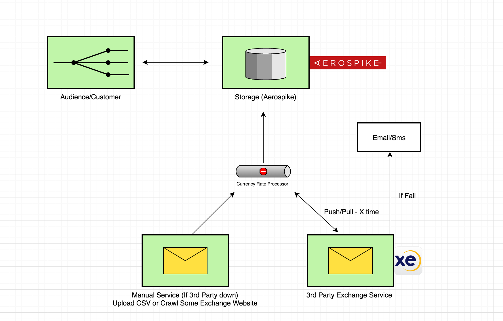

# Forex

 Flow diagram:

*I am using AEROSPIKE here because-
*1.High Availability & Uptime
*2.Superior Scalability
*3.Real-Time Engine and many more.

*Excahnge Service Provider May Be Any one.

*Currency Processor should work in two way
*1.Manual Upload service or Crawler Service (In Case our Exchange is not responding)
*2.If 3rd Party Exchange is responding then , it pulled out data from Exchange and update back to the **AEROSPIKE**
*3.If Updation is not happen or Exchange is down then, there is a notifcation engine which notify the stack holder 
about this situation.
After that our scrapper or manual csv uploads comes in picture.

*Our Throughput will increase if we start communicating with such noSQL.

